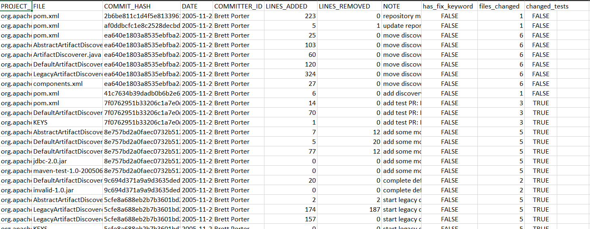
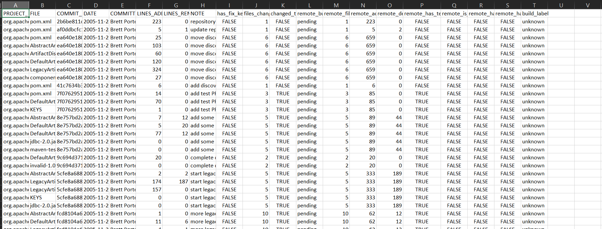
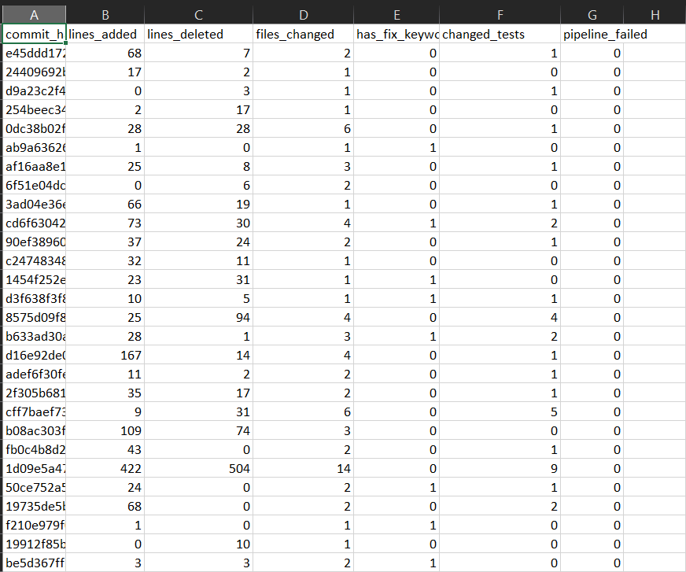

# Build Failure Prediction Dataset Creation


## Approach 1: Technical Debt Dataset Enhancement


### Overview
This approach leverages the existing [Technical Debt Dataset](https://github.com/clowee/The-Technical-Debt-Dataset) from 33 Apache Software Foundation Java projects. The dataset contains over 1 million commit samples with basic metadata (commit_sha, date, file, lines_added, lines_removed, notes). Enhance this data by extracting additional features and attempting to label build outcomes via GitHub API.

### Data Source
- **Origin**: Technical Debt Dataset (Apache Software Foundation)
- **Projects**: 33 Java projects
- **Scale**: >1 million commit samples
- **Initial Features**: commit_sha, date, file, lines_added, lines_removed, notes

### Data Pipeline
git_commit.csv
↓
enhanced_git_commit.csv
↓
labeled_git_commit.csv
```
Technical Debt Dataset (gitcommitchanges.csv)
     CSV Structure Fixing & Feature Extraction
Enhanced Dataset (enhanced_gitcommitchanges.csv)
    ↓ GitHub API Build Labeling
Labeled Dataset (labeled_git_commit_changes.csv)
```

### Implementation Files
| Component | File | Purpose |
|-----------|------|---------|
| **Data Processor** | `get_metadata_from_commit.py` | Fixes CSV structure, extracts commit features |
| **Build Labeler** | `label.py` | Attempts build outcome labeling via GitHub API |
| **Data Inspector** | `data.py` | Dataset analysis and validation |

### Dataset Structure

**Input CSV Structure** (Technical Debt Dataset):
```
PROJECT_ID, FILE, COMMIT_HASH, DATE, COMMITTER_ID, LINES_ADDED, LINES_REMOVED, NOTE
```

**Enhanced CSV Structure** (after get_metadata_from_commit.py):
```
PROJECT_ID, FILE, COMMIT_HASH, DATE, COMMITTER_ID, LINES_ADDED, LINES_REMOVED, NOTE,
has_fix_keyword, files_changed, changed_tests
```

**Final Labeled CSV Structure** (after label.py):
```
PROJECT_ID, FILE, COMMIT_HASH, DATE, COMMITTER_ID, LINES_ADDED, LINES_REMOVED, NOTE,
has_fix_keyword, files_changed, changed_tests, build_label, remote_files_changed,
remote_additions, remote_deletions, remote_has_ci, remote_has_pr, gha_workflow_names
```

### Features Extracted
**Basic Commit Features**:
- `files_changed` - Number of files modified per commit
- `has_fix_keyword` - Presence of fix-related keywords in commit messages  
- `changed_tests` - Boolean indicating test file modifications
- `lines_added/removed` - Code change volume metrics

**Attempted Build Labels**:
- `build_label` - Build outcome attempts: `passed`, `failed`, `no_ci`, `unknown`
- `remote_has_ci` - CI/CD pipeline detection
- `remote_has_pr` - Pull request association


### Pros
- **Massive Scale**: Access to >1 million commit samples
- **Established Projects**: Data from mature Apache Software Foundation projects
- **Historical Depth**: Long-term project evolution data
- **Java Focus**: Consistent technology stack across projects
- **Rich Metadata**: Detailed commit information already available
- **No Repository Cloning**: Works with existing CSV data
- **Fast Processing**: Efficient handling of large datasets

### Cons
- **Labeling Challenges**: Many GitHub Actions return 'pending' or 'not_processed'
- **Missing Build Data**: Historical commits often lack corresponding CI/CD runs
- **Old Projects**: Some Apache projects may have outdated CI/CD practices
- **Limited Build Context**: Difficulty correlating commits with actual build outcomes
- **API Limitations**: GitHub API may not have historical build data for older commits
- **Inconsistent CI/CD**: Varied CI/CD adoption across different Apache projects
- **Data Quality Issues**: Some commits may not have clear build outcome mappings

### Current Limitations
- **Build Labeling Ineffective**: Most attempts result in 'pending' or 'not_processed' status
- **Historical Gap**: Older commits lack modern CI/CD pipeline data
- **Correlation Issues**: Difficulty matching commits to corresponding builds

---

## Approach 2: Fresh Public Repository Mining

### Overview
This approach collects fresh data directly from public GitHub repositories with active GitHub Actions workflows. It first extracts build outcome data (id, sha, conclusion) from GitHub Actions, then uses PyDriller to mine detailed commit metadata, ensuring accurate build-commit correlation.

### Data Source
- **Origin**: Live public GitHub repositories
- **Selection Criteria**: Active GitHub Actions workflows
- **Scale**: Smaller datasets (hundreds to thousands of commits)
- **Quality**: High-quality build outcome labels

### Data Pipeline
```
Public GitHub Repository
    ↓ GitHub Actions Data Collection
Build Outcomes (gha_runs.json)
    ↓ PyDriller Commit Mining
Labeled Dataset (pr_dataset.csv)
```

### Implementation Files
| Component | File | Purpose |
|-----------|------|---------|
| **Build Collector** | `github_actions_pull.py` | Extracts GitHub Actions workflow results |
| **Repository Miner** | `mine.py` | Mines commit data using PyDriller with build correlation |

### Dataset Structure

**GitHub Actions JSON Structure** (gha_runs.json):
```json
{
  "id": "workflow_run_id",
  "head_sha": "commit_hash", 
  "conclusion": "success|failure|cancelled|skipped",
  "event": "push|pull_request",
  "workflow_name": "CI workflow name"
}
```

**Final CSV Structure** (pr_dataset.csv):
```
commit_hash, lines_added, lines_deleted, files_changed, has_fix_keyword, changed_tests, pipeline_failed
```

### Features Extracted
**Build Outcome Labels**:
- `pipeline_failed` - Binary target variable (0=success, 1=failure)
- `conclusion` - Detailed build status from GitHub Actions

**Detailed Git Metrics**:
- `lines_added/deleted` - Precise line counts from git diffs
- `changed_tests` - Count of modified test files
- `files_changed` - Number of files modified
- `has_fix_keyword` - Fix-related keyword detection (0/1)
- `commit_hash` - Unique commit identifier

**Advanced Features** (via PyDriller):
- File-level change analysis
- Commit message sentiment analysis
- Developer activity patterns
- Code complexity metrics


### Pros
- **Clean Build Labels**: Direct correlation between commits and build outcomes
- **Modern CI/CD**: Works with current GitHub Actions workflows
- **High Data Quality**: Accurate build-commit relationships
- **Rich Feature Set**: Comprehensive git metadata via PyDriller
- **Flexible Repository Selection**: Can target specific types of projects
- **Real-time Data**: Fresh data from active development
- **Precise Measurements**: Exact line counts and file modifications

### Cons
- **Limited Scale**: Smaller datasets compared to historical approaches
- **Public Repository Constraint**: Limited to publicly accessible repositories
- **Processing Intensive**: Slower due to full repository analysis
- **Storage Requirements**: Needs local repository clones for optimal performance
- **Setup Complexity**: More complex configuration and dependencies
- **Repository Dependency**: Requires active GitHub Actions workflows
- **Network Intensive**: Repository cloning can be bandwidth-heavy

### Current Status
- **Data Volume**: Limited to public repositories with active CI/CD
- **Quality Focus**: Emphasis on accurate build outcome labeling
- **Scalability Challenge**: Need to expand to more repositories for larger datasets

---

## Approach Comparison

| Aspect | Approach 1 (Technical Debt) | Approach 2 (Fresh Mining) |
|--------|------------------------------|----------------------------|
| **Dataset Size** | >1 million samples | Hundreds to thousands |
| **Data Quality** | High volume, poor labels | Lower volume, high-quality labels |
| **Build Labeling** | Problematic (pending/not_processed) | Accurate (success/failure) |
| **Processing Speed** | Fast (CSV processing) | Slow (full git analysis) |
| **Historical Depth** | Extensive (years of data) | Recent (active projects) |
| **Setup Complexity** | Low | Medium-High |
| **Research Value** | Large-scale analysis | Precise prediction models |
| **Reproducibility** | High | Medium |

## Data Schema Reference

### Column Descriptions

**Common Columns (Both Approaches)**:
| Column | Type | Description | Example |
|--------|------|-------------|---------|
| `commit_hash` | string | SHA-1 commit identifier | `e45ddd17242da2dc479e69f613563f68efa66170` |
| `lines_added` | integer | Number of lines added in commit | `68` |
| `lines_deleted` | integer | Number of lines removed in commit | `7` |
| `files_changed` | integer | Number of files modified | `3` |
| `has_fix_keyword` | boolean/integer | Contains fix-related keywords (fix, bug) | `1` (True) or `0` (False) |
| `changed_tests` | boolean/integer | Test files were modified | `1` (True) or `0` (False) |

**Approach 1 Specific Columns**:
| Column | Type | Description | Example |
|--------|------|-------------|---------|
| `PROJECT_ID` | string | Apache project identifier | `org.apache:maven` |
| `FILE` | string | Modified file path | `src/main/java/Main.java` |
| `DATE` | datetime | Commit timestamp | `2023-01-15 14:30:00+00:00` |
| `COMMITTER_ID` | string | Committer identifier | `john.doe` |
| `NOTE` | string | Commit message | `fix: resolve null pointer exception` |
| `build_label` | string | Build outcome | `passed`, `failed`, `no_ci`, `unknown` |
| `remote_has_ci` | boolean | Has CI/CD pipeline | `True`/`False` |
| `remote_has_pr` | boolean | Part of pull request | `True`/`False` |

**Approach 2 Specific Columns**:
| Column | Type | Description | Example |
|--------|------|-------------|---------|
| `pipeline_failed` | integer | Binary build outcome | `0` (success) or `1` (failure) |

### Sample Data

**Approach 1 Sample** (labeled_git_commit_changes.csv):
```csv
PROJECT_ID,FILE,COMMIT_HASH,DATE,COMMITTER_ID,LINES_ADDED,LINES_REMOVED,NOTE,has_fix_keyword,files_changed,changed_tests,build_label,remote_has_ci,remote_has_pr
org.apache:maven,pom.xml,abc123...,2023-01-15 14:30:00,john.doe,5,2,"fix: update dependency",1,2,0,passed,1,1
```

**Approach 2 Sample** (pr_dataset.csv):
```csv
commit_hash,lines_added,lines_deleted,files_changed,has_fix_keyword,changed_tests,pipeline_failed
e45ddd17242da2dc479e69f613563f68efa66170,68,7,2,0,1,0
24409692b6400116f732a13dd18541df56c46121,17,2,1,0,0,0
```

## Research Challenges & Solutions

### Current Challenges
1. **Approach 1 Labeling Issues**: Historical commits lack corresponding build data
2. **Approach 2 Scale Limitations**: Limited to public repositories with active CI/CD
3. **Feature Engineering**: Need for dependency and environment-related features

### Future Development Directions
- **Enhanced Feature Collection**: 
  - Dependency change analysis
  - Environment configuration tracking
  - Code complexity metrics
  - Developer experience indicators

- **Improved Labeling Strategies**:
  - Alternative build outcome sources
  - Hybrid labeling approaches
  - Manual validation for critical samples

- **Scale Expansion**:
  - Multi-repository data collection
  - Cross-language project analysis
  - Enterprise repository integration


